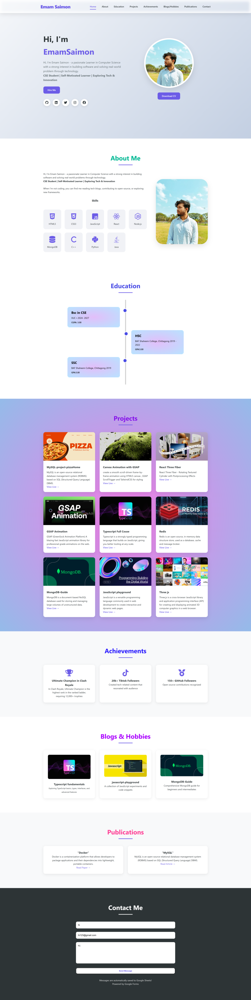

### Figma Prototype Link

Click here to view the Figma Prototype:  
https://www.figma.com/proto/eUceQU9B1FJe3zgs0xh0ld/portfolio_web_design?node-id=0-1&t=hBIoANMZ5RGsPOh8-1

---

### What's Included in the Design

1.  Navigation Bar &
2.  Hero Section
3.  About section
4.  education section
5.  Projects section
6.  Achievements section
7.  Blogs / Hobbies
8.  Publications &
9.  Contact

---

### full page screenshort is Given Below

  

---

# Executive Summary:
This project involves the development of a personal portfolio website aimed at showcasing my skills, projects, and professional background as a computer science student. The primary objective is to create a responsive, user-friendly site that serves as a digital resume for potential employers and peers. Target users include recruiters, fellow developers, and academic professionals. The website is built using core web technologies: HTML5 for structure, CSS3 for styling, and JavaScript (ES6) for interactivity. Key features include sections for personal information, project showcases, and contact details, with a responsive design ensuring accessibility across devices. The site is deployed on GitHub Pages for free, reliable hosting.

# Live URL
https://htmlpreview.github.io/?https://github.com/EmamSaimon592/My_portfolio/blob/main/index.html

# References
1. MDN Web Docs.
2. W3C Standards.
3. GitHub Pages documentation.
4. JavaScript documentation